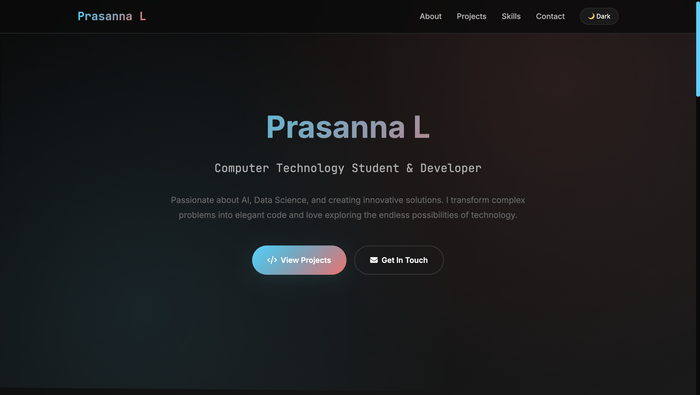

# 💼 Prasanna L - Portfolio Website

A modern, responsive portfolio website built with **HTML**, **CSS**, and **JavaScript**. Designed to showcase my projects, technical skills, and contact information with clean UI, smooth animations, and mobile-first design principles.

---

## 🚀 Features

- Responsive design for all devices
- Dark theme with toggle switch
- Animated hero and background elements
- Project showcase with live and GitHub links
- Skills grid with icons
- Contact section with social links
- Clean, accessible HTML and semantic structure

---

## 🛠️ Tech Stack

- **HTML5**
- **CSS3**
- **JavaScript (Vanilla)**
- **Font Awesome** for icons
- **Google Fonts** for typography

---

## 📸 Preview

---

## 📂 Folder Structure

portfolio/
├── index.html
├── Resources/
│ └── style.css
│ └── Images/
│   └── IMG_6956.jpeg
├──README.md

---

## 🧑‍💻 Author

**Prasanna L**  
Computer Technology Student & Developer  
[LinkedIn](https://www.linkedin.com/in/prasanna-l-b99767356/) | [GitHub](https://github.com/Prasanna-46)

---

## 🌐 Live Demo

🔗 [View Portfolio]() &nbsp;

---

## 📬 Contact

Got an opportunity or collaboration in mind?  
Reach me at: `prasannal14.04@gmail.com`

---

## 📄 License

This project is licensed under the [MIT License](LICENSE).

